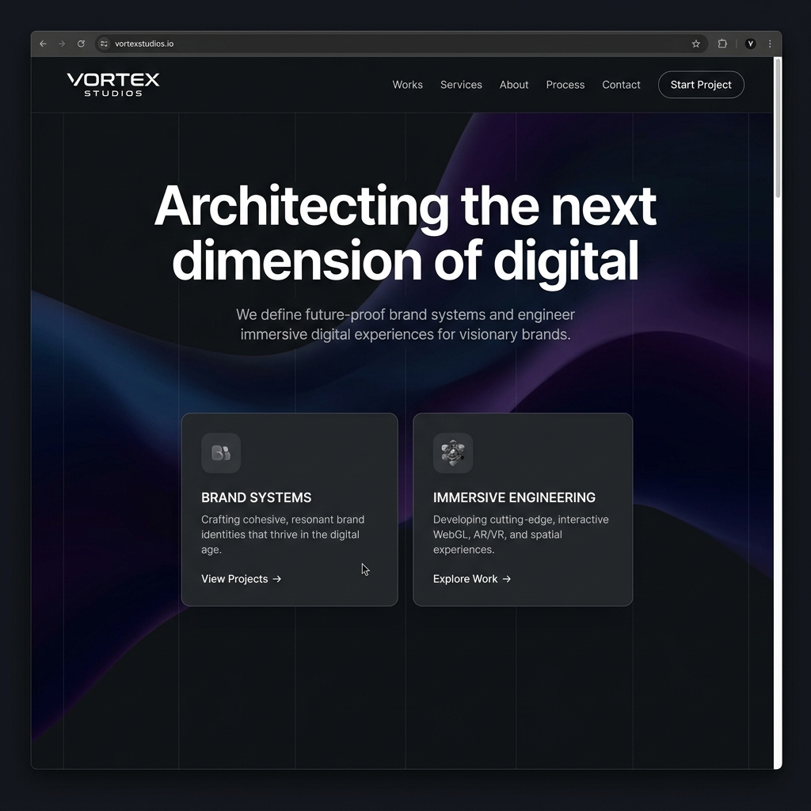

# Vortex Studios | Immersive Creative Agency Landing Page

An elite, high-fidelity landing page for **Vortex Studios**, a next-generation creative studio specializing in immersive design, spatial systems, and custom AI agent architectures.



## Key Features

- **WebGL Ambient Shader**: A fluid, interactive color-shifting backdrop simulation powered by **Three.js**.
- **Interactive Spatial Schema**: A custom dark-theme node connecting grid visualizer representing the production pipeline method.
- **Draggable Cards**: A custom interactive desktop experience showing pricing tiers that users can drag and drop across a 3D perspective plane.
- **Editorial Testimonials Slider**: A responsive carousel component featuring premium client quotes and reviews from industry disruptors.
- **Micro-Animations**: Hover effects, sticky backdrop blurs, exponential count-up statistics, and typewriter text simulations.
- **Tailwind Layout**: Pixel-perfect responsive grids optimized for desktop, tablet, and mobile displays.

## Technology Stack

- **Core**: HTML5, Vanilla JavaScript (ES6)
- **Styling**: Tailwind CSS (CDN)
- **Animations**: Three.js, CSS Keyframes
- **Icons**: Iconify

## Getting Started

To run the project locally, clone this repository and spin up a local HTTP server:

```bash
# Clone the repository
git clone https://github.com/ArnavNah/Vortex-Studio.git

# Navigate into the folder
cd Vortex-Studio

# Start a simple HTTP server (Python 3)
python -m http.server 3000
```

Once the server is running, open [http://localhost:3000](http://localhost:3000) in your browser.

## Project Structure

```text
├── assets/
│   └── main.js      # Three.js animation setup, scroll reveal, counters, & accordion logic
├── index.html       # Rebranded agency structural markup & styling wrappers
├── screenshot.png   # Website layout screenshot
└── README.md        # Documentation
```
